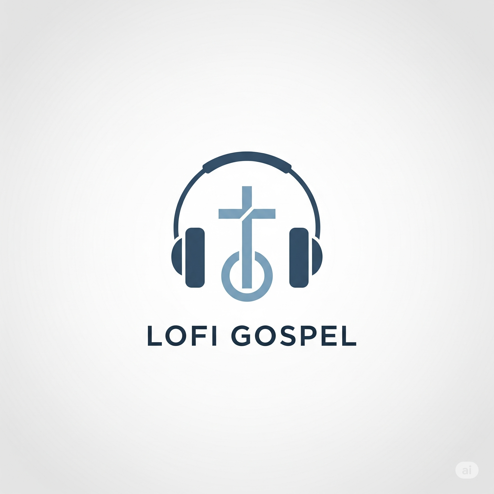

<div align="center">
   
</div>
<br>

# Bot de Rádio Lofi Gospel para Discord

Um bot simples para tocar estações de rádio Lofi Gospel em servidores Discord. Comandos restritos a administradores e moderadores.

## Recursos

- Toca rádios Lofi Gospel 24/7 em canais de voz.
- Permite alternar entre estações disponíveis.
- Comandos acessíveis apenas para admins/mods.
- Interface com botões para mudar estação ou sair do canal.

## Instalação

1. **Clone o repositório:**
   ```bash
   git clone https://github.com/seu-usuario/lofi-gospel.git
   cd lofi-gospel
   ```

2. **Instale as dependências:**
   ```sh
   npm install
   ```

3. **Configure o token do bot:**
   - No arquivo [`index.js`](index.js), substitua `'SEU_TOKEN_AQUI'` pelo token do seu bot Discord.

4. **Inicie o bot:**
   ```sh
   npm start
   ```

## Comandos

- `!sjoin` — Entra no canal de voz e começa a tocar a rádio.
- `!sleave` — Sai do canal de voz.
- `!shelp` — Exibe mensagem de ajuda.

> [!note]
> Se ocorrer algum erro no código, os USERS que estão no array, serão notificados para resolver o problema e checar os logs do bot onde está hospedado.
> `const LOG_ACCESS_USER_IDS = ['USER', 'USER2'];`


> **Observação:** Apenas administradores ou moderadores com permissão de gerenciar servidor podem usar os comandos.

## Configuração para Square Cloud

O arquivo [`squarecloud.config`](squarecloud.config) já está pronto para deploy na Square Cloud.

## Licença

MIT © Jeiel